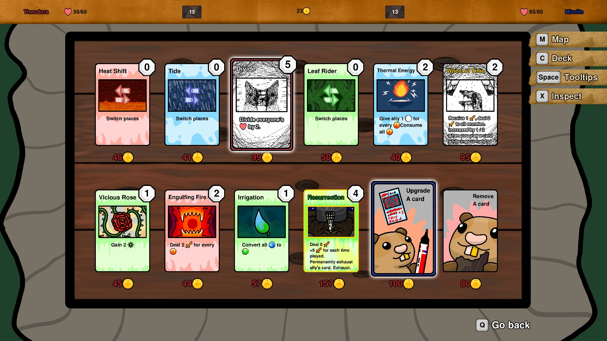
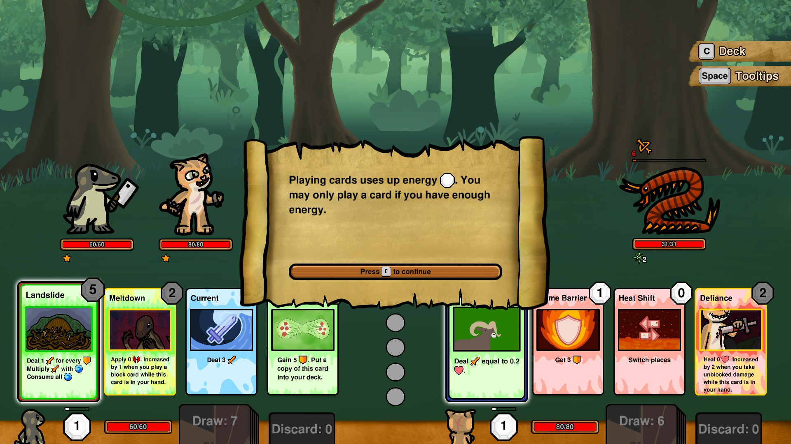

# MLEM.Ui Gallery

Many of the [games made with MLEM](https://mlem.ellpeck.de/index.html#made-with-mlem) use **MLEM.Ui** for their user interfaces. Here are some screenshots of what they achieve with it!

## [Tiny Life](https://tinylifegame.com)

## [Vulcard](https://store.steampowered.com/app/3764530/Vulcard/)

## [Touchy Tickets](https://ell.lt/touchytickets)

## [Foe Frenzy](https://store.steampowered.com/app/1194170/Foe_Frenzy/)

## [A Breath of Spring Air](https://ellpeck.itch.io/a-breath-of-spring-air)

