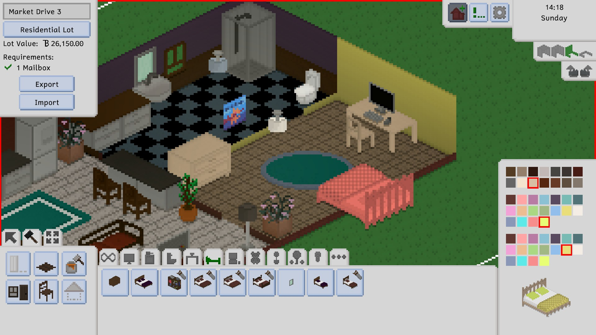
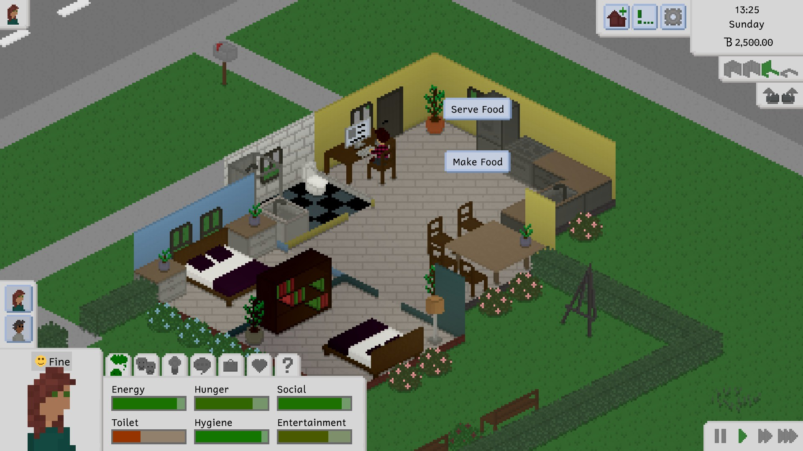
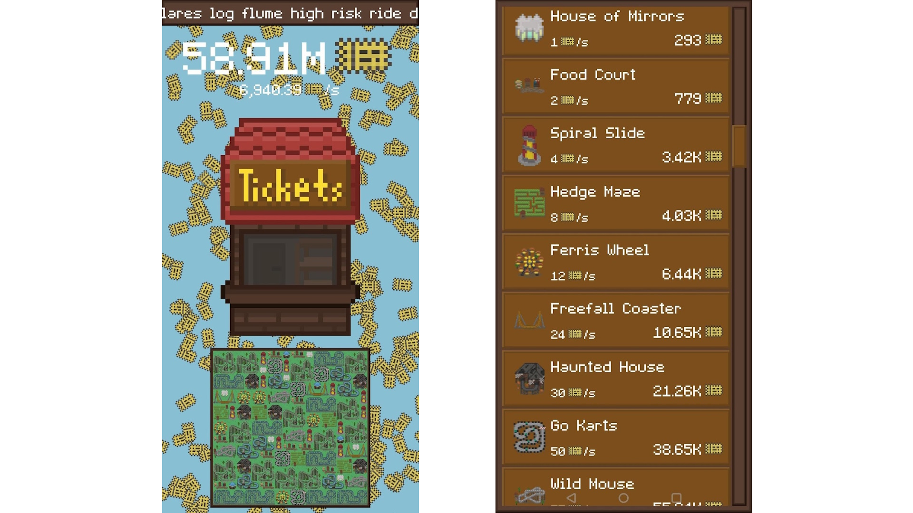
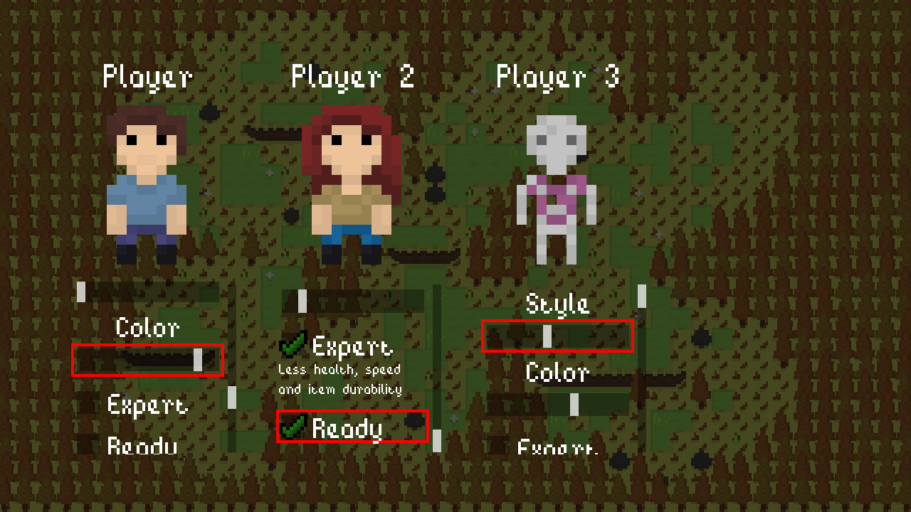
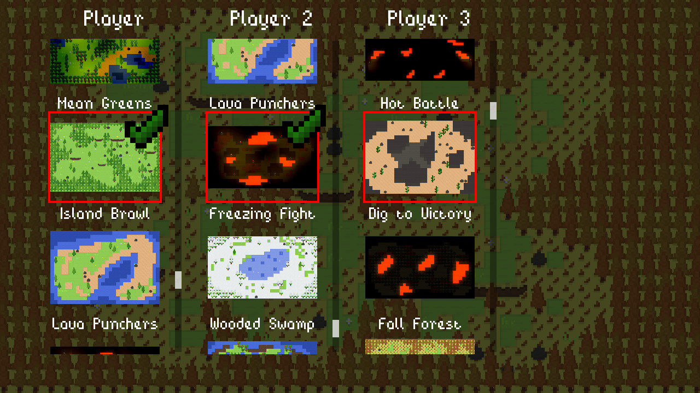
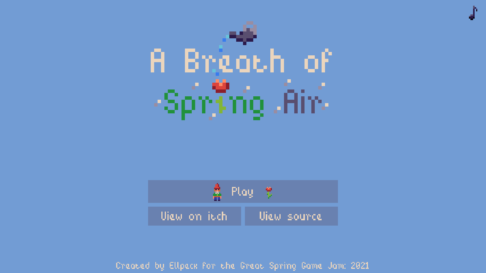

# MLEM.Ui Gallery

Many of the [games made with MLEM](https://mlem.ellpeck.de/index.html#made-with-mlem) use **MLEM.Ui** for their user interfaces. Here are some screenshots of what they achieve with it!

Tiny Life

Tiny Life

Touchy Tickets

Foe Frenzy

Foe Frenzy

A Breath of Spring Air
