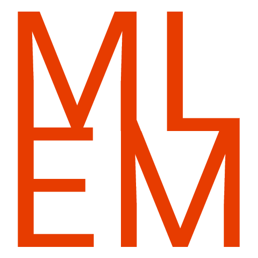

**MLEM Library by Ellpeck for MonoGame** is an addition to the game framework [MonoGame](https://www.monogame.net/) that provides extension methods, quality of life improvements and additional features like a ui system and easy input handling.

# What next?
- Get it on [NuGet](https://www.nuget.org/packages?q=mlem)
- Get prerelease builds on [BaGet](https://nuget.ellpeck.de)
- See the source code on [GitHub](https://github.com/Ellpeck/MLEM)
- Check out [the demos](https://github.com/Ellpeck/MLEM/tree/master/Demos) on [Desktop](https://github.com/Ellpeck/MLEM/tree/master/Demos.DesktopGL) or [Android](https://github.com/Ellpeck/MLEM/tree/master/Demos.Android)

# Gallery
Here are some images that show a couple of MLEM's features.

MLEM.Ui in action:  

MLEM's text formatting system:  
