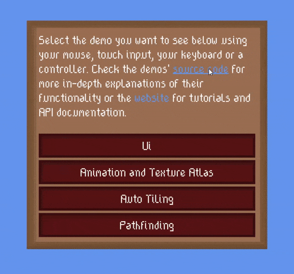
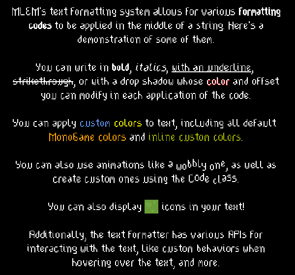

**MLEM Library for Extending MonoGame** is an addition to the game framework [MonoGame](https://www.monogame.net/) that provides extension methods, quality of life improvements and additional features like a ui system and easy input handling.

# What next?
- Get it on [NuGet](https://www.nuget.org/packages?q=mlem)
- Get prerelease builds on [BaGet](https://nuget.ellpeck.de)
- See the source code in this repository
- See tutorials and API documentation on [the website](https://mlem.ellpeck.de/)
- Check out [the demos](https://github.com/Ellpeck/MLEM/tree/main/Demos) on [Desktop](https://github.com/Ellpeck/MLEM/tree/main/Demos.DesktopGL) or [Android](https://github.com/Ellpeck/MLEM/tree/main/Demos.Android)
- See [the changelog](https://github.com/Ellpeck/MLEM/blob/main/CHANGELOG.md) for information on updates

# Made with MLEM
- [A Breath of Spring Air](https://ellpeck.itch.io/a-breath-of-spring-air), a short platformer ([Source](https://git.ellpeck.de/Ellpeck/GreatSpringGameJam))
- [Don't Wake Up](https://ellpeck.itch.io/dont-wake-up), a short puzzle game ([Source](https://github.com/Ellpeck/DontLetGo))
- [Tiny Life](https://tinylifegame.com), an isometric life simulation game ([Modding API](https://github.com/Ellpeck/TinyLifeExampleMod))

If you created a game with the help of MLEM, you can get it added to this list by submitting it on the [issue tracker](https://github.com/Ellpeck/MLEM/issues). If its source is public, other people will be able to use your project as an example, too!

# Gallery
Here are some images that show a couple of MLEM's features.

The [MLEM.Ui](https://mlem.ellpeck.de/articles/ui) demo in action:

MLEM's [text formatting system](https://mlem.ellpeck.de/articles/text_formatting), which is compatible with both MLEM.Ui and regular sprite batch rendering:

# Friends of MLEM
There are several other NuGet packages and tools that work well in combination with MonoGame and MLEM. Here are some of them:
- [Contentless](https://github.com/Ellpeck/Contentless), a tool that removes the need to add assets to the MonoGame Content Pipeline manually
- [GameBundle](https://github.com/Ellpeck/GameBundle), a tool that packages MonoGame and other .NET Core applications into several distributable formats
- [MonoGame.Extended](https://github.com/craftworkgames/MonoGame.Extended), a package that also provides several additional features for MonoGame
- [Coroutine](https://github.com/Ellpeck/Coroutine), a package that implements Unity-style coroutines for any project