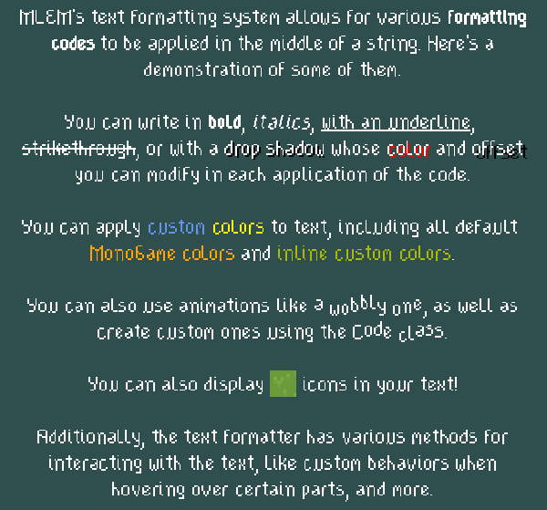

**MLEM Library for Extending MonoGame** is an addition to the game framework [MonoGame](https://www.monogame.net/) that provides extension methods, quality of life improvements and additional features like a ui system and easy input handling.

# What next?
- Get it on [NuGet](https://www.nuget.org/packages?q=mlem)
- Get prerelease builds on [BaGet](https://nuget.ellpeck.de)
- See the source code in this repository
- See tutorials and API documentation on [the website](https://mlem.ellpeck.de/)
- Check out [the demos](https://github.com/Ellpeck/MLEM/tree/main/Demos) on [Desktop](https://github.com/Ellpeck/MLEM/tree/main/Demos.DesktopGL) or [Android](https://github.com/Ellpeck/MLEM/tree/main/Demos.Android)

# Made with MLEM
- [Don't Wake Up](https://ellpeck.itch.io/dont-wake-up), a short puzzle game ([Source](https://github.com/Ellpeck/DontLetGo))
- [Tiny Life](https://tinylifegame.com), an isometric life simulation game ([Modding API](https://github.com/Ellpeck/TinyLifeExampleMod))

If you created a game with the help of MLEM, you can get it added to this list by submitting it on the [issue tracker](https://github.com/Ellpeck/MLEM/issues). If its source is public, other people will be able to use your project as an example, too!

# Gallery
Here are some images that show a couple of MLEM's features.

MLEM.Ui in action:  

MLEM's text formatting system:  
